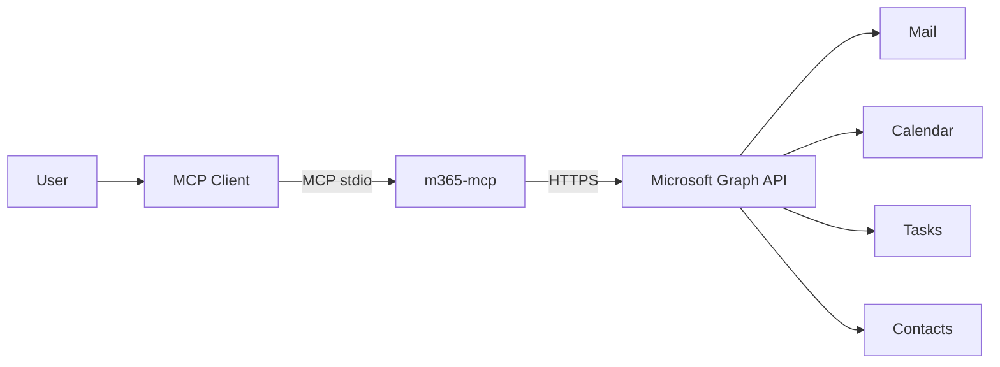
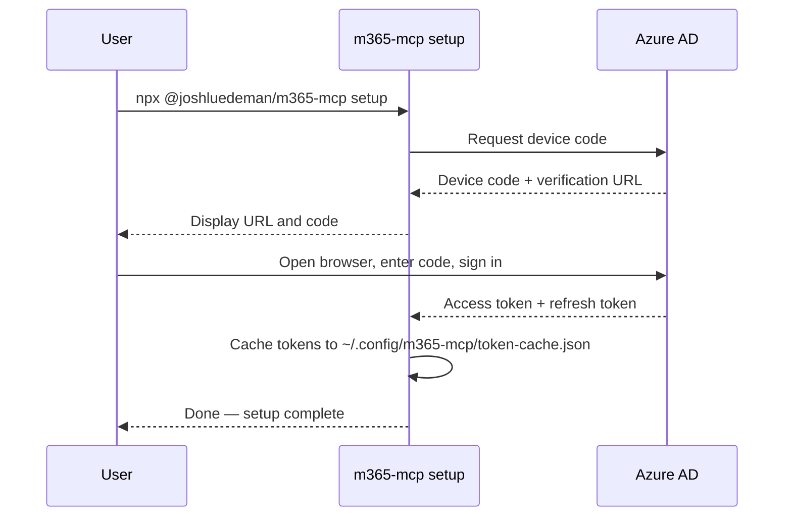

# 📬 m365-mcp

**Microsoft 365 tools for any MCP-compatible AI client — Mail, Calendar, Tasks, and Contacts via the Microsoft Graph API.**

[](https://www.npmjs.com/package/@joshluedeman/m365-mcp)
[](./LICENSE)
[](https://github.com/joshluedeman/m365-mcp/actions)
[](https://www.npmjs.com/package/@joshluedeman/m365-mcp)

`m365-mcp` is a [Model Context Protocol](https://modelcontextprotocol.io) server that connects your Microsoft 365 account to any MCP-compatible AI client. It exposes 22 tools across Mail, Calendar, Tasks (Microsoft To Do), and Contacts — all authenticated via a single device code sign-in with no Azure portal setup required. It runs over stdio and works with Claude Desktop, Claude Code, Cursor, Zed, Windsurf, and any other MCP-compatible client.

---

## ✨ Features

- 📧 **Mail** — search, read, send, flag, and organize email across folders
- 📅 **Calendar** — search events, create/update meetings, find free/busy availability
- ✅ **Tasks** — full Microsoft To Do integration: task lists, tasks, create/complete/delete
- 👤 **Contacts** — search, read, create, and update personal contacts
- 🔐 **Zero Azure setup** — ships with a pre-registered multi-tenant app; no portal configuration required
- 📦 **npx distribution** — run with `npx @joshluedeman/m365-mcp`, no global install needed
- 🖥 **Any MCP client** — Claude Desktop, Claude Code, Cursor, Zed, Windsurf, and more

---

## 🏗 How it works



---

## 🚀 Quick Start

**1. (Optional) Install globally**

```bash
npm install -g @joshluedeman/m365-mcp
```

Or skip this and use `npx` directly — it works either way.

**2. Run setup**

```bash
npx @joshluedeman/m365-mcp setup
```

This opens a browser for device code sign-in. Sign in with your Microsoft 365 account and the token is cached to `~/.config/m365-mcp/token-cache.json`. You will not be prompted again unless the refresh token expires (~90 days).

**3. Add to your MCP client**

Most MCP clients accept a JSON server definition in this form:

```json
{
  "mcpServers": {
    "m365": {
      "command": "npx",
      "args": ["m365-mcp"]
    }
  }
}
```

**Claude Desktop** — edit `~/Library/Application Support/Claude/claude_desktop_config.json` (macOS) or `%APPDATA%\Claude\claude_desktop_config.json` (Windows).

**Claude Code** — add via CLI:

```bash
claude mcp add m365 -- npx @joshluedeman/m365-mcp
```

**Cursor** — add to `.cursor/mcp.json` in your project or `~/.cursor/mcp.json` globally.

**Zed** — add to your Zed settings under `"context_servers"`.

**Other clients** — consult your client's MCP server configuration docs; the command is `npx @joshluedeman/m365-mcp`.

---

## 🔐 Authentication

Authentication uses the [MSAL device code flow](https://learn.microsoft.com/en-us/azure/active-directory/develop/v2-oauth2-device-code). No Azure CLI, no service principal, no secrets to manage.



On subsequent runs the server loads the cached token silently. The refresh token is valid for approximately 90 days; re-run `npx @joshluedeman/m365-mcp setup` if it expires.

---

## 🛠 Available Tools

### Mail

| Tool | Description |
|------|-------------|
| `search_emails` | Search emails by keyword, sender, date range, or folder |
| `read_email` | Read the full content of an email by ID |
| `send_email` | Send a new email |
| `flag_email` | Flag or unflag an email for follow-up |
| `list_mail_folders` | List all mail folders in the mailbox |
| `move_email` | Move an email to a different folder |

### Calendar

| Tool | Description |
|------|-------------|
| `search_events` | Search calendar events by keyword or time range |
| `get_event` | Get full details of a calendar event by ID |
| `create_event` | Create a new calendar event |
| `update_event` | Update an existing calendar event |
| `find_availability` | Find free/busy availability across attendees |

### Tasks (Microsoft To Do)

| Tool | Description |
|------|-------------|
| `list_task_lists` | List all task lists |
| `list_tasks` | List tasks in a task list |
| `get_task` | Get details of a specific task |
| `create_task` | Create a new task in a task list |
| `update_task` | Update an existing task |
| `complete_task` | Mark a task as completed |
| `delete_task` | Delete a task |

### Contacts

| Tool | Description |
|------|-------------|
| `search_contacts` | Search personal contacts by name or email |
| `get_contact` | Get full details of a contact by ID |
| `create_contact` | Create a new personal contact |
| `update_contact` | Update an existing contact |

---

## ⚙️ Enterprise / Advanced Configuration

### Environment variables

| Variable | Description |
|----------|-------------|
| `M365_MCP_CLIENT_ID` | Override the built-in app registration with your own Azure AD client ID |
| `M365_MCP_TENANT_ID` | Restrict authentication to a specific tenant (defaults to `common`) |

### Config file override

Create `~/.config/m365-mcp/config.json` to set options persistently:

```json
{
  "clientId": "your-azure-ad-app-client-id",
  "tenantId": "your-tenant-id"
}
```

Environment variables take precedence over the config file.

### Enterprise consent

The built-in app registration is multi-tenant and supports personal Microsoft accounts. First-time sign-in for work/school accounts will show an **"unverified publisher"** consent screen — this is expected for community-distributed apps. An Azure AD admin can pre-consent on behalf of the organization to suppress this prompt for all users. If your organization requires a verified app registration, use the `M365_MCP_CLIENT_ID` override with your own registered application.

---

## 🤝 Contributing

Contributions are welcome. See [CONTRIBUTING.md](./CONTRIBUTING.md) for development setup, branching conventions, and the pull request process.

---

## 📄 License

MIT — see [LICENSE](./LICENSE).
